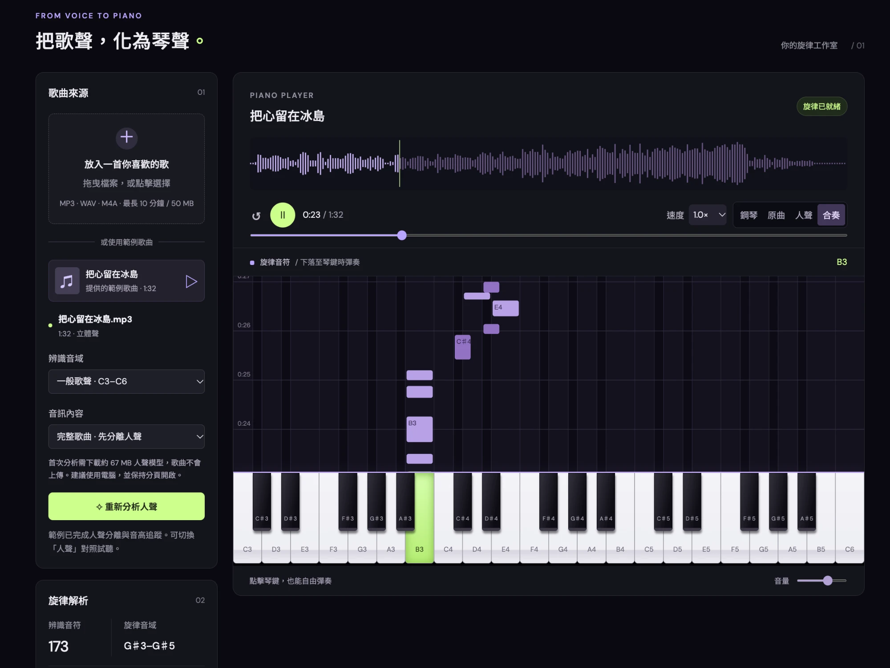

<a id="readme-top"></a>

<div align="center">

# 🎹 SingKeys

**Turn a singing voice into piano melody — right in your browser.**
**把歌聲，化為琴聲 — 全程在瀏覽器裡完成。**

[🇺🇸 English](#english) · [🇹🇼 繁體中文](#zh-tw)




</div>

---

<a id="english"></a>

## 🇺🇸 English

> 🌐 Language: **English** · [繁體中文](#zh-tw)

SingKeys is a static web app that listens to a song, isolates the lead vocal, tracks its pitch, and plays it back as piano notes falling onto an on-screen keyboard. Everything runs locally in your browser, so your audio is never uploaded.

### ✨ Features

- 🎤 **Vocal separation**: the Kim Vocal 2 (MDX-Net) model runs on ONNX Runtime Web in a dedicated CPU/WASM worker.
- 🎼 **Pitch tracking**: YIN candidates every 20 ms, Viterbi continuity to suppress octave errors, then smoothing, hysteresis and onset-aware note segmentation.
- 🎹 **Falling-notes piano**: synchronized note waterfall, key highlights and note names. Click the keys to play freely.
- 🎧 **Four playback modes**: Piano · Original · Vocals · Mix (original + piano).
- 🐢 **Speed control**: 0.5×–1.25× with pitch preservation for audio tracks.
- 🎚️ **Range presets**: Voice (C3–C6), Low voice (C2–C5), Wide (A2–C7).
- 💾 **MIDI export**: detected notes as MIDI format 0 (480 PPQ, 120 BPM).
- 🔒 **Private by design**: no server and no uploads. The model is downloaded once, verified by SHA-256, and cached.
- 🎵 **Built-in demo**: a pre-analyzed sample song so you can try it immediately.

### 🚀 Quick Start

```sh
npm ci
npm run build
npm test
python3 -m http.server 4173 --bind 127.0.0.1 --directory dist
```

Then open <http://127.0.0.1:4173>. Web workers require HTTP(S), so opening `index.html` directly from disk won't work.

### 🧭 How to Use

1. 📂 Drop in an audio file (MP3 / WAV / M4A, up to 10 minutes / 50 MB), or pick the demo song.
2. 🎛️ Choose the pitch range and the source type: **full song** (separate the vocals first) or **clean vocal** (analyze directly).
3. ✨ Click **Analyze**. The first run downloads a ~67 MB vocal model, so keep the tab open.
4. ▶️ Play it back, switch modes, slow it down, or export a MIDI file.

### 🛠️ Pipeline

| Step | What happens |
| --- | --- |
| 1️⃣ Decode | Browser-supported audio, resampled to stereo 44.1 kHz |
| 2️⃣ Separate | Kim Vocal 2 via ONNX Runtime Web; STFT/ISTFT from `web-audio-separation`; chunked overlap-add |
| 3️⃣ Gate | Resample vocals to 12 kHz; drop quiet or non-periodic frames |
| 4️⃣ Track | YIN + Viterbi + median smoothing + pitch hysteresis |
| 5️⃣ Segment | Onset-aware notes; anything shorter than 75 ms is discarded |
| 6️⃣ Play | Additive-synth piano, falling notes, MIDI export |

### 📁 Project Structure

```
dist/       Deployable static site (page modules, WASM runtime, demo assets)
src/        Separation worker source (bundled by esbuild into dist/)
scripts/    Build script and demo preparation/analysis tools
tests/      Node tests for pitch tracking, MIDI and STFT reconstruction
licenses/   Third-party licenses
```

See [DEVELOPMENT.md](DEVELOPMENT.md) for detailed technical notes.

### ⚠️ Limitations

- Produces a **monophonic melody**, not chords or a full piano arrangement.
- Separation may keep some accompaniment or backing vocals, or drop soft parts of the lead voice.
- Harmonies, breathy singing, slides and heavy reverb can cause wrong or missing notes.
- CPU separation takes time, so a desktop browser is recommended.

### 🙏 Acknowledgements

- [ONNX Runtime Web](https://github.com/microsoft/onnxruntime) (MIT)
- [web-audio-separation](https://www.npmjs.com/package/web-audio-separation) (MIT)
- Kim Vocal 2 model from [Politrees/UVR_resources](https://huggingface.co/Politrees/UVR_resources) (MIT)

<p align="right">(<a href="#readme-top">⬆️ back to top</a>)</p>

---

<a id="zh-tw"></a>

## 🇹🇼 繁體中文

> 🌐 語言：[English](#english) · **繁體中文**

SingKeys 是一個純前端的網頁工具：匯入一首歌，它會分離出主唱人聲、追蹤音高，再把旋律變成落在琴鍵上的鋼琴音符。所有運算都在瀏覽器本機完成，歌曲不會上傳。

### ✨ 功能特色

- 🎤 **人聲分離**：在獨立的 CPU/WASM Worker 中用 ONNX Runtime Web 執行 Kim Vocal 2（MDX-Net）模型。
- 🎼 **音高追蹤**：每 20 ms 取一次 YIN 候選音高，用 Viterbi 連續性抑制八度誤判，再做平滑、遲滯與起音偵測切分音符。
- 🎹 **音符瀑布鋼琴**：音符落下、琴鍵高亮與音名同步顯示，也可以直接點琴鍵自由彈奏。
- 🎧 **四種播放模式**：鋼琴 · 原曲 · 人聲 · 合奏（原曲＋鋼琴）。
- 🐢 **變速播放**：0.5×–1.25×，音訊軌保持原音高。
- 🎚️ **音域預設**：一般歌聲（C3–C6）、低音歌聲（C2–C5）、寬音域（A2–C7）。
- 💾 **匯出 MIDI**：辨識出的音符可輸出為 MIDI format 0（480 PPQ、120 BPM）。
- 🔒 **重視隱私**：沒有伺服器、不上傳檔案。模型只下載一次，經 SHA-256 驗證後快取。
- 🎵 **內建範例歌曲**：已預先分析完成，打開就能試玩。

### 🚀 快速開始

```sh
npm ci
npm run build
npm test
python3 -m http.server 4173 --bind 127.0.0.1 --directory dist
```

接著開啟 <http://127.0.0.1:4173>。Web Worker 需要透過 HTTP(S) 載入，直接雙擊 `index.html` 無法執行。

### 🧭 使用方式

1. 📂 拖曳音訊檔（MP3 / WAV / M4A，最長 10 分鐘 / 50 MB），或選擇範例歌曲。
2. 🎛️ 選擇辨識音域與音訊內容：**完整歌曲**（先分離人聲）或**清唱／已分離人聲**（直接分析）。
3. ✨ 按下「分析」。首次分析需要下載約 67 MB 的人聲模型，請保持分頁開啟。
4. ▶️ 播放、切換模式、放慢速度，或匯出 MIDI。

### 🛠️ 處理流程

| 步驟 | 說明 |
| --- | --- |
| 1️⃣ 解碼 | 讀取瀏覽器支援的音訊，重新取樣為 44.1 kHz 立體聲 |
| 2️⃣ 分離 | 以 ONNX Runtime Web 執行 Kim Vocal 2；STFT/ISTFT 來自 `web-audio-separation`；分段重疊相加 |
| 3️⃣ 篩選 | 人聲降頻至 12 kHz，濾除過小聲或非週期性的音框 |
| 4️⃣ 追蹤 | YIN + Viterbi + 中位數平滑 + 音高遲滯 |
| 5️⃣ 切分 | 依起音切分音符，短於 75 ms 的音符捨棄 |
| 6️⃣ 播放 | 加法合成鋼琴、音符瀑布、MIDI 匯出 |

### 📁 專案結構

```
dist/       可直接部署的靜態網站（頁面模組、WASM runtime、範例素材）
src/        人聲分離 Worker 原始碼（由 esbuild 打包至 dist/）
scripts/    建置腳本與範例歌曲的前處理／分析工具
tests/      音高追蹤、MIDI 與 STFT 重建的 Node 測試
licenses/   第三方授權條款
```

更詳細的技術說明請見 [DEVELOPMENT.md](DEVELOPMENT.md)。

### ⚠️ 已知限制

- 輸出的是**單音旋律**，不是和弦或完整的鋼琴編曲。
- 人聲分離可能殘留伴奏或和聲，也可能漏掉主唱較輕的段落。
- 和聲、氣音、滑音與強烈殘響可能導致音符錯誤或遺漏。
- CPU 分離需要一些時間，建議使用電腦版瀏覽器。

### 🙏 致謝

- [ONNX Runtime Web](https://github.com/microsoft/onnxruntime)（MIT）
- [web-audio-separation](https://www.npmjs.com/package/web-audio-separation)（MIT）
- Kim Vocal 2 模型來自 [Politrees/UVR_resources](https://huggingface.co/Politrees/UVR_resources)（MIT）

<p align="right">(<a href="#readme-top">⬆️ 回到頂端</a>)</p>
